# 需求

文件监听工具，可以监听本地文件操作(创建、删除、修改、重命名、移动等不限于此)产生的系统消息，可用于辅助开发决策和问题排查

具体需求如下:

- [x] 需要设计 Qt 界面,将监听选项暴露给用户选择,监听函数使用 Win32 函数 ReadDirectoryChangesW或者 ReadDirectoryChangesExW (异步),不是使用 Qt 原生的监控类

- [x] 用户可以设置要监听的文件夹路径，可以同时监控多个目录(包括子目录),并且支持监听的暂停、恢复,

- [x] 可以设置关注的文件后缀列表和忽略的文件后缀列表

- [x] 可以指定或者排除指定文件监控  

- [x] 用户可以进行配置，并保存在指定的配置文件中,下次可以读取用户配置

- [x] 监听到的消息显示在界面，并且可以保存到文件（文件类型不限）,可简单实现为提供界面按钮作为操作入口

- [x] 实现监听信息日志与用户操作日志，并在界面上提供查询日志的入口，可以根据时间段进行查询

- [x] 可以对监控信息进行关键字搜索,并显示搜索结果,支持排序

- [x] 最小化托盘,并且监听到文件变化的时候有消息提示

- [x] 界面使用纯代码实现，不能使用第三方库(如日志库等)

# 视频展示：

文件路径：./assets/文件监听器展示.mp4

# 文件监听工具项目介绍

 

[TOC]


## 一、项目背景与目标

在软件开发和系统维护过程中，实时监控文件系统的变化是一个非常重要的需求。文件操作如创建、删除、修改、重命名等，往往会对系统的稳定性和安全性产生重大影响，尤其是在开发和调试阶段，能够及时捕捉这些变化有助于发现潜在的问题，进而提高开发效率和系统可靠性。

本项目旨在开发一个基于 Qt 和 Win32 API 的文件监听工具，提供一个高效、可靠的文件监控解决方案。通过使用 Windows 底层 API 和 Qt 的图形用户界面，该工具能够实时监控本地文件系统的变化，并将这些变化记录为日志，供用户分析和查阅。项目不仅关注功能的实现，还在用户体验、性能优化、内存管理等方面做了深入的设计与优化，力求为用户提供一个高效、稳定的监控工具。

## 二、项目功能与特点

### 1. 高效的文件监控机制

#### 1.1 使用 Win32 API 实现文件监控

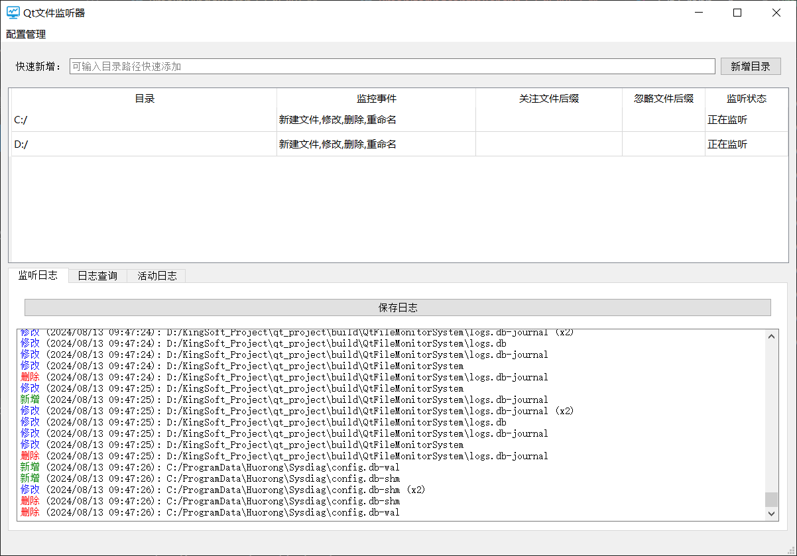

本项目采用了 Windows 的 `ReadDirectoryChangesW` API 实现文件监控。该API 直接与操作系统内核交互，能够捕捉到文件系统中的低级别变化，保证了监控的实时性和高效性。相比于 Qt 的文件监控类，这种方法更加底层，更适合对性能要求较高的场景。

同时，在监控层对指定文件后缀和指定文件路劲进行过滤，达到文件变动消息过滤的效果。

```C++
// 定义一个函数来监控目录变化
void KMonitorWorker::monitorDirectory()
{
    // 如果监控已暂停或未激活，立即返回
    if (m_paused || !m_monitoring)
        return;

    // 将目录路径从QString转换为std::wstring
    std::wstring path = m_directoryPath.toStdWString();

    // 打开目录句柄，设置必要的标志以读取目录变化
    m_directoryHandle = CreateFileW(
        path.c_str(),
        FILE_LIST_DIRECTORY,
        FILE_SHARE_READ | FILE_SHARE_WRITE | FILE_SHARE_DELETE,
        NULL,
        OPEN_EXISTING,
        FILE_FLAG_BACKUP_SEMANTICS | FILE_FLAG_OVERLAPPED,
        NULL);

    // 如果句柄无效，记录错误并返回
    if (m_directoryHandle == INVALID_HANDLE_VALUE)
    {
        qDebug() << "Failed to get directory handle.";
        return;
    }

    // 缓冲区用于存储目录变更信息
    char buffer[1024];
    DWORD bytesReturned;
    FILE_NOTIFY_INFORMATION* pNotify;
    QString fileName;

    // 在监控活动且未暂停的情况下持续监控
    while (m_monitoring && !m_paused)
    {
        // 读取目录变化
        if (ReadDirectoryChangesW(
            m_directoryHandle,
            buffer,
            sizeof(buffer),
            TRUE,
            FILE_NOTIFY_CHANGE_FILE_NAME | FILE_NOTIFY_CHANGE_DIR_NAME | FILE_NOTIFY_CHANGE_ATTRIBUTES |
            FILE_NOTIFY_CHANGE_SIZE | FILE_NOTIFY_CHANGE_LAST_WRITE | FILE_NOTIFY_CHANGE_LAST_ACCESS |
            FILE_NOTIFY_CHANGE_CREATION | FILE_NOTIFY_CHANGE_SECURITY,
            &bytesReturned,
            NULL,
            NULL))
        {
            pNotify = (FILE_NOTIFY_INFORMATION*)buffer;

            do
            {
                // 从通知信息中提取文件名
                fileName = QString::fromWCharArray(pNotify->FileName, pNotify->FileNameLength / sizeof(WCHAR));
                // 提取文件扩展名
                QString fileExtension = QString(".") + QFileInfo(fileName).suffix();

                bool shouldEmitSignal = true;

                // 判断文件扩展名是否在包含的扩展名列表中
                if (!m_includeExtensions.isEmpty() && !m_includeExtensions.contains(fileExtension, Qt::CaseInsensitive))
                {
                    shouldEmitSignal = false;
                }

                // 判断文件扩展名是否在排除的扩展名列表中
                if (!m_excludeExtensions.isEmpty() && m_excludeExtensions.contains(fileExtension, Qt::CaseInsensitive))
                {
                    shouldEmitSignal = false;
                }

                // 判断文件路径是否在包含的文件路径列表中
                if (!m_includeFiles.isEmpty() && !m_includeFiles.contains(QDir(m_directoryPath).filePath(fileName), Qt::CaseInsensitive))
                {
                    shouldEmitSignal = false;
                }

                // 判断文件路径是否在排除的文件路径列表中
                if (!m_excludeFiles.isEmpty() && m_excludeFiles.contains(QDir(m_directoryPath).filePath(fileName), Qt::CaseInsensitive))
                {
                    shouldEmitSignal = false;
                }

                // 仅在需要监控且符合过滤条件时触发相应的信号
                if (m_shouldMonitor && shouldEmitSignal)
                {
                    switch (pNotify->Action)
                    {
                    case FILE_ACTION_ADDED:
                        if (m_eventsState[0])
                            emit fileAdded(QDir(m_directoryPath).filePath(fileName));
                        break;
                    case FILE_ACTION_REMOVED:
                        if (m_eventsState[2]) emit fileRemoved(QDir(m_directoryPath).filePath(fileName));
                        break;
                    case FILE_ACTION_MODIFIED:
                        if (m_eventsState[1]) emit fileModified(QDir(m_directoryPath).filePath(fileName));
                        break;
                    case FILE_ACTION_RENAMED_OLD_NAME:
                        if (pNotify->NextEntryOffset)
                        {
                            pNotify = (FILE_NOTIFY_INFORMATION*)((LPBYTE)pNotify + pNotify->NextEntryOffset);
                            QString newFileName = QString::fromWCharArray(pNotify->FileName, pNotify->FileNameLength / sizeof(WCHAR));
                            if (m_eventsState[3]) emit fileRenamed(QDir(m_directoryPath).filePath(fileName), QDir(m_directoryPath).filePath(newFileName));
                        }
                        break;
                    default:
                        break;
                    }
                }

                // 移动到下一个通知条目，如果没有则结束循环
                pNotify = pNotify->NextEntryOffset
                    ? (FILE_NOTIFY_INFORMATION*)((LPBYTE)pNotify + pNotify->NextEntryOffset)
                    : NULL;
            } while (pNotify);
        }
        else
        {
            qDebug() << "ReadDirectoryChangesW failed.";
            break;
        }
    }

    // 关闭目录句柄
    CloseHandle(m_directoryHandle);
    m_directoryHandle = INVALID_HANDLE_VALUE;

    // 如果监控未暂停，使用QTimer在下一个事件循环中重新启动监控
    if (m_monitoring && !m_paused)
    {
        QTimer::singleShot(0, this, &KMonitorWorker::monitorDirectory);
    }
}

```


#### 1.2 异步监控与线程优化

项目通过 Qt 的 `QThread` 实现文件监控的异步处理。每个监控任务都运行在独立的线程中，这种设计保证了主界面的流畅性，不会因为文件监控的频繁触发而影响用户的操作体验。此外，使用 `QMutex` 进行线程间数据同步，避免了数据竞争和资源冲突，提高了系统的稳定性。

```C++
// 定义一个函数来启动监控特定路径
void KFileMonitor::startMonitoring(const QString& path)
{
    // 检查是否已经有针对该路径的监控线程，如果有则直接返回
    if (m_monitorThreads.contains(path))
        return;

    // 创建一个监控工作对象，并将路径传递给它
    KMonitorWorker* worker = new KMonitorWorker(path);
    // 创建一个新的线程
    QThread* thread = new QThread(this);

    // 连接线程的started信号到worker的startMonitoring槽函数，以开始监控
    (void)connect(thread, &QThread::started, worker, &KMonitorWorker::startMonitoring);
    // 连接线程的finished信号到worker的deleteLater槽函数，以确保对象被正确删除
    (void)connect(thread, &QThread::finished, worker, &KMonitorWorker::deleteLater);
    // 连接worker发出的文件添加信号到本类的onFileAdded槽函数
    (void)connect(worker, &KMonitorWorker::fileAdded, this, &KFileMonitor::onFileAdded);
    // 连接worker发出的文件移除信号到本类的onFileRemoved槽函数
    (void)connect(worker, &KMonitorWorker::fileRemoved, this, &KFileMonitor::onFileRemoved);
    // 连接worker发出的文件修改信号到本类的onFileModified槽函数
    (void)connect(worker, &KMonitorWorker::fileModified, this, &KFileMonitor::onFileModified);
    // 连接worker发出的文件重命名信号到本类的onFileRenamed槽函数
    (void)connect(worker, &KMonitorWorker::fileRenamed, this, &KFileMonitor::onFileRenamed);

    // 将工作对象移至新线程
    worker->moveToThread(thread);
    // 启动线程
    thread->start();

    // 将新的线程和工作对象加入到监控映射中，以便管理
    m_monitorThreads.insert(path, thread);
    m_monitorWorkers.insert(path, worker);

    // 初始化该路径的事件状态，确保所有类型的文件事件都被监控
    m_eventsStateMap.insert(path, QVector<bool>{true, true, true, true});
}

```

### 2. 灵活的监控配置

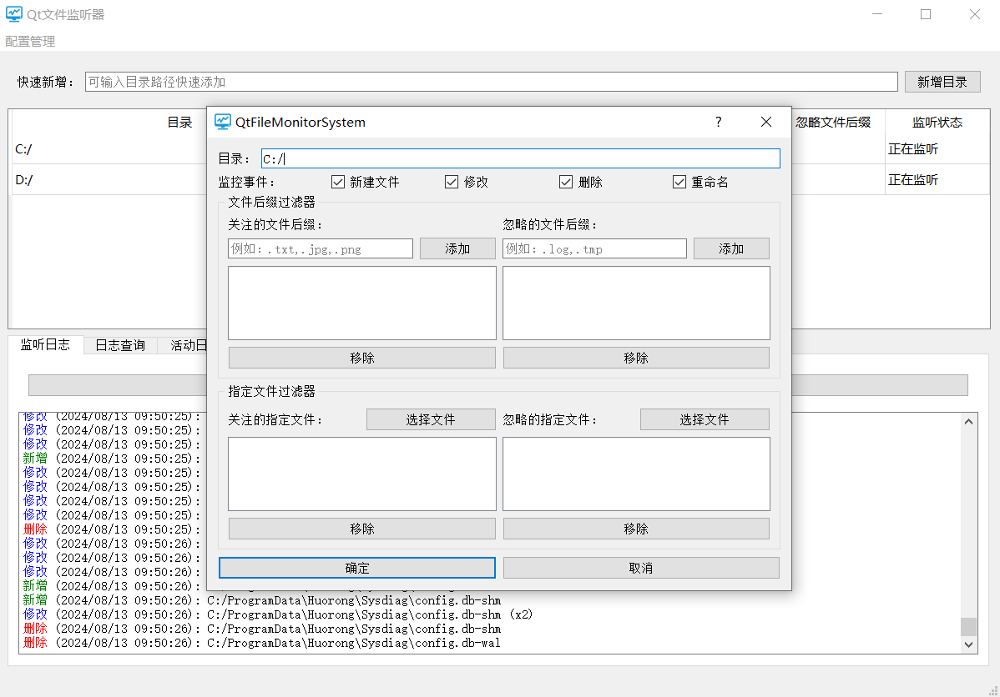

#### 2.1 子目录监控与事件监控

用户可以在界面上设置多个需要监控的目录，这些目录可以是不同的磁盘分区，或者同一分区内的不同文件夹。工具还支持对子目录的监控，这种灵活的配置方式使得工具适用于各种复杂的监控需求。

对某一栏目录进行双击，或者鼠标右键编辑，即可打开信息修改窗口。根据需要可对具体监听设置进行修改。事件包括：新建、修改、删除、重命名。可对其每个事件选择监听或者不监听。

如下图所示：对C:/盘进行监听时，只选择监听修改和删除事件，则下方日志中只会打印这2类事件。

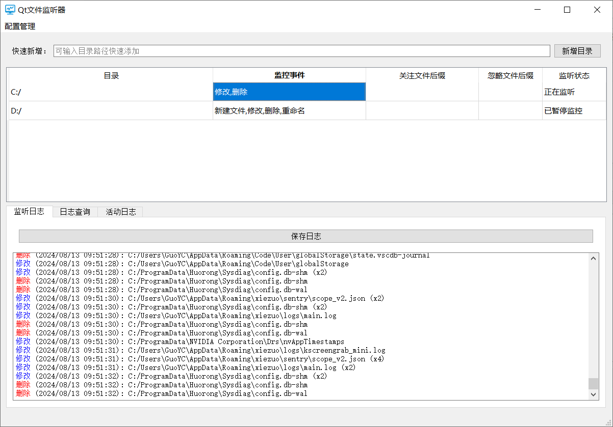

#### 2.2 文件后缀与指定文件过滤

项目提供了文件后缀和指定路径文件的过滤功能，用户可以指定监控特定后缀的文件（如 `.txt`、`.log`），也可以忽略某些文件（如临时文件或日志文件）。此外，用户还可以通过指定文件名的方式，精确控制监控的范围。这些设置帮助用户减少无关信息的干扰，专注于重要的文件操作。

一个文件的变动事件通过过滤器的判断依据为：

 .png)


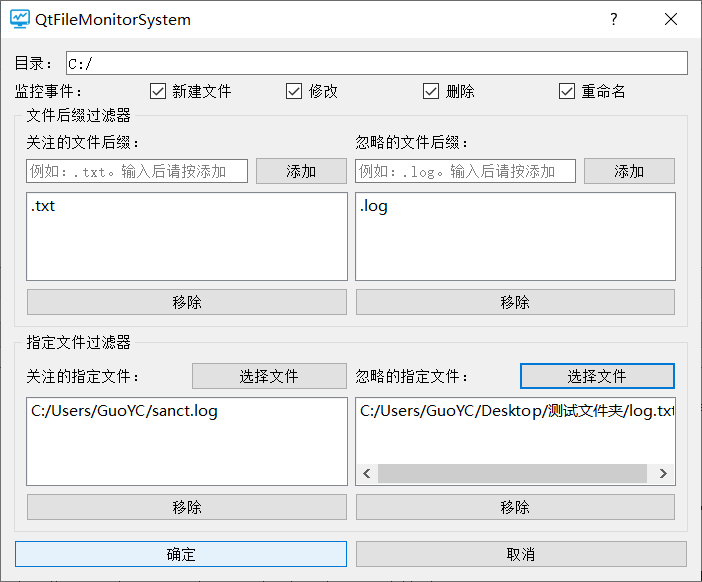

#### 2.3 配置持久化与加载

用户的所有监控配置都可以保存到配置文件中，并在下次启动时选择配置加载。这一功能不仅提高了用户体验，还确保了监控设置的一致性和可重复性，尤其适用于长期监控和复杂环境下的应用场景。

导出配置：将当前监听的所有目录以及配置细节，保存为本地json文件。

导入配置：选定json文件，解析文件内容，并创建对象加载到系统中。

该功能通过KDirectoryModelExporter静态单例类提供。

```json
[
    {
        "events": [
            "新建文件",
            "修改",
            "删除",
            "重命名"
        ],
        "excludeExtensions": [
        ],
        "excludeFiles": [
        ],
        "includeExtensions": [
        ],
        "includeFiles": [
        ],
        "monitorState": "正在监听",
        "path": "C:/Users/GuoYC/Desktop/测试文件夹"
    },
    {
        "events": [
            "新建文件",
            "修改",
            "删除",
            "重命名"
        ],
        "excludeExtensions": [
        ],
        "excludeFiles": [
        ],
        "includeExtensions": [
        ],
        "includeFiles": [
        ],
        "monitorState": "正在监听",
        "path": "C:/"
    }
]

```


### 3. 详尽的日志管理

#### 3.1 实时日志记录

工具能够将监听到的每一次文件操作（如创建、删除、修改等）都实时记录为日志，并显示在界面上。日志信息包括操作的时间、文件路径、操作类型等详细内容，用户可以随时查看这些信息，以了解系统中发生的文件变化。

如下图所示：

- 不同的事件，会显示不同的颜色

- 显示事件发生事件、文件路径
- 同一时间，同一文件连续触发同一事件，则会压缩日志信息。信息末尾会显示被压缩的个数。例如：（x2）、（x4）。

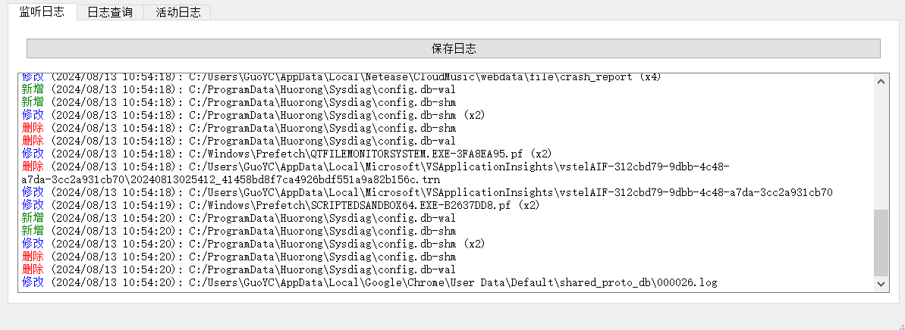

#### 3.2 日志查询与关键字搜索

为了帮助用户快速定位关键信息，项目实现了日志查询和关键字搜索功能。用户可以根据时间段查询日志，或者通过输入关键字进行搜索。搜索结果还支持排序，用户可以按需排列日志，方便查阅和分析。这一功能特别适用于处理大量日志信息的场景，极大提高了信息检索的效率。

该日志查询操作、均通过对数据库中日志数据进行查询获取。

鼠标单击每列表头，即可实现根据单列数据正序或逆序排序。默认按时间递增排序 。

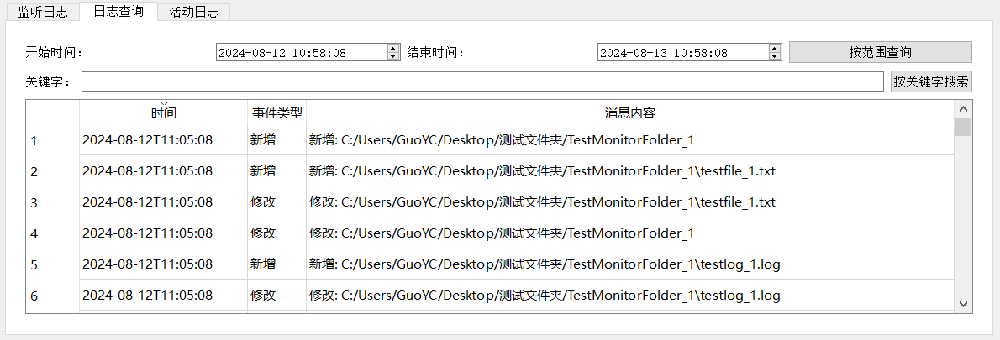

#### 3.3 日志持久化与导出

项目支持将日志信息保存到文件中，用户可以选择将日志导出为文本文件或其他格式的文件。这一功能方便了日志的长期存储和备份，同时也为后续的日志分析提供了数据基础。用户可以根据需要将日志文件分享给其他团队成员或用于进一步的分析工具。

通过导出日志按钮，可选择导出的日志的文件路径和文件名。可将监听日志的消息内容，写入到日志文件中。

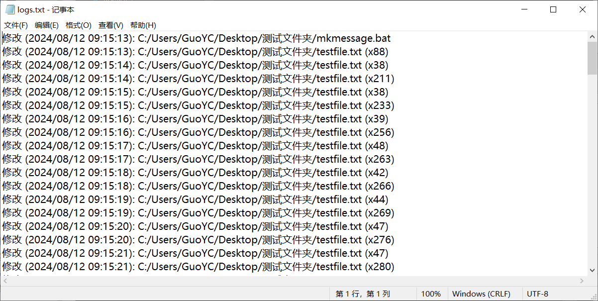

### 4. 用户体验优化

#### 4.1 最小化托盘与消息提示

工具支持最小化到系统托盘，用户在不使用时可以将其隐藏在托盘中，避免占用桌面空间。当监控到文件变化时，系统托盘会弹出提示消息，提醒用户查看。这种设计既保证了工具的隐蔽性，又能及时传达重要信息，确保用户不会错过关键的文件操作。

点击窗口关闭按钮时，会弹出对话框，选择关闭或最小化。

窗口最小化后，当有事件被监听时，会弹出消息窗口提醒。

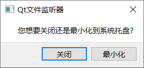

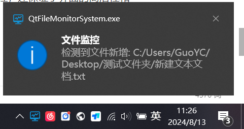

鼠标右键托盘小图标或鼠标双击，即可重新打开主界面。也可选择退出程序。


#### 4.2 图形用户界面设计

项目的用户界面全部采用 Qt 纯代码实现，避免了对第三方库的依赖。这种设计不仅增强了项目的可移植性，还保证了界面的简洁性和一致性。界面设计注重用户体验，操作简单直观，用户无需具备专业知识即可轻松配置和使用工具。

- 界面上方为一个状态栏，可进行配置的导入和导出。

- 主界面窗口顶部为一个快速添加监听目录的组件，可快速输入文件路径直接监听，也可选择指定路径进行监听。
- 第一个表格组件表示当前正在被监听的目录列表，同时展示对该目录的监听事件等信息。鼠标右键可对其进行编辑。
- 第二个tab表格组件，包括监听日志打印组件框、日志查询框、活动日志打印框。日志查询框中既可显示数据库中查询的日志信息。

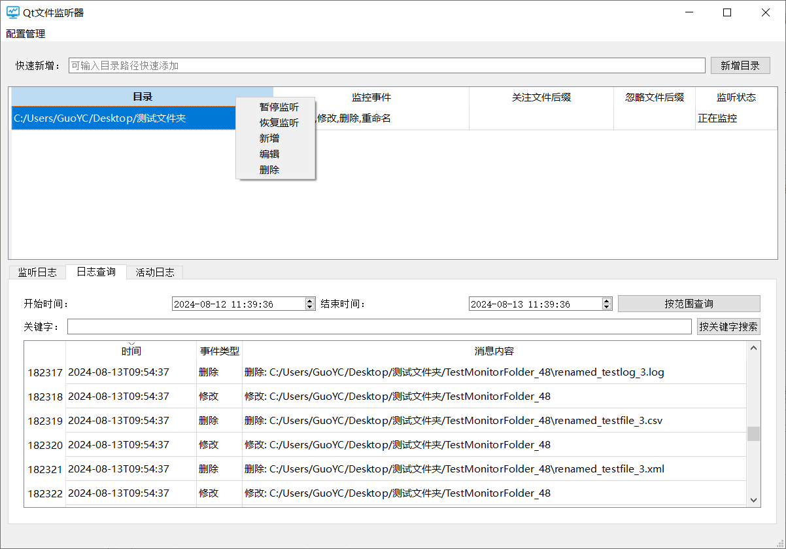

### 5. 数据库存储

#### 5.1 数据时钟轮转批量插入处理

 为应对大量日志数据等待插入，我们通过数据库的批处理技术和事务技术，提高数据库插入操作的效率和稳定性。如果插入失败，则进行回滚

同时，为放置大量数据同时产生，造成程序运行卡顿，采用缓存技术，将待插入数据保存至队列中，每1秒为周期，将队列中的数据按固定数量插入数据库中。

```C++
void KLogDatabaseHandler::insertLog(const QString& eventType, const QString& message)
{
    sqlDate date;
    date.time = QDateTime::currentDateTime().toString(Qt::ISODate);
    date.type = eventType;
    date.message = message;

    m_pool.enqueue(date);// 加入队列中
}

void KLogDatabaseHandler::insertPoolData() // 定时器每秒处理一次
{
    QMutexLocker locker(&dbMutex);  // 保护数据库操作
    const int batchSize = 500;  // 每次处理的最大日志数量

    if (!m_pool.isEmpty()) 
    {
        QSqlQuery query(m_db);
        query.prepare("INSERT INTO logs (timestamp, event_type, message) VALUES (:timestamp, :event_type, :message)");

        QVariantList timestamps, eventTypes, messages;
        int count = 0;

        while (!m_pool.isEmpty() && count < batchSize) 
        {
            const auto& log = m_pool.dequeue();
            timestamps << log.time;
            eventTypes << log.type;
            messages << log.message;
            count++;
        }

        query.bindValue(":timestamp", timestamps);
        query.bindValue(":event_type", eventTypes);
        query.bindValue(":message", messages);

        // 先检查是否已经在事务中
        if (!m_db.transaction()) 
        {
            qDebug() << "Error: Failed to start transaction." << m_db.lastError();
            return;
        }

        if (!query.execBatch()) 
        {
            qDebug() << "Error: Failed to execute batch insert." << query.lastError();
            m_db.rollback();
        }
        else if (!m_db.commit()) 
        {
            qDebug() << "Error: Failed to commit transaction." << m_db.lastError();
            m_db.rollback();
        }
        else 
        {
            qDebug() << "Batch insert and transaction committed successfully.";
        }
    }
}
```

#### 5.2 数据库索引 

为提高数据库查询效率，提高程序的用户体验，在数据库表设计时，针对高频使用的时间列查询，对时间列建立的索引。在时间段查询时，可以具有良好的性能表现。

```C++
// 定义一个函数来初始化数据库
void KLogDatabaseHandler::initializeDatabase()
{
    QMutexLocker locker(&dbMutex);  // 使用互斥锁保护数据库初始化过程，防止多线程并发访问

    // 根据当前线程ID生成唯一的数据库连接名
    QString connectionName = QString("ConnThread%1").arg((quintptr)QThread::currentThreadId());
    // 添加一个SQLite数据库连接
    m_db = QSqlDatabase::addDatabase("QSQLITE", connectionName);
    // 设置数据库文件名
    m_db.setDatabaseName("logs.db");

    // 尝试打开数据库连接
    if (!m_db.open()) 
    {
        // 如果连接失败，打印错误信息并退出函数
        qDebug() << "Error: Failed to connect to database." << m_db.lastError();
        return;
    }

    // 创建一个SQL查询对象
    QSqlQuery query(m_db);
    // 定义创建日志表的SQL语句，如果表不存在则创建
    QString createTableQuery = "CREATE TABLE IF NOT EXISTS logs ("
        "id INTEGER PRIMARY KEY AUTOINCREMENT, "  // 自增主键
        "timestamp DATETIME, "                    // 时间戳字段
        "event_type TEXT, "                       // 事件类型字段
        "message TEXT)";                          // 消息文本字段

    // 执行创建表的SQL语句
    if (!query.exec(createTableQuery)) 
    {
        // 如果创建表失败，打印错误信息
        qDebug() << "Error: Failed to create table." << query.lastError();
    }

    // 定义创建时间戳索引的SQL语句，以提高查询效率
    QString createIndexQuery = "CREATE INDEX IF NOT EXISTS idx_timestamp ON logs (timestamp)";

    // 执行创建索引的SQL语句
    if (!query.exec(createIndexQuery)) 
    {
        // 如果创建索引失败，打印错误信息
        qDebug() << "Error: Failed to create index on timestamp column." << query.lastError();
    }
}

```


## 三、性能与内存优化

### 1. 性能优化

#### 1.1 数据库批量操作与事务处理

在日志记录方面，项目使用了 SQLite 数据库进行管理。通过将日志的插入操作批量处理，并使用数据库的事务机制，项目在保证数据完整性的同时，提高了日志写入的性能。这种设计在高频率的文件操作场景下尤为重要，避免了频繁的磁盘 IO 操作，显著提升了系统的响应速度。

#### 1.2 事件监听多线程处理

项目将不同的目录监控任务分配到不同的子线程中执行，利用多核 CPU 的优势提高处理效率。确保监控任务与用户界面操作之间的平衡，不会因为监控任务的复杂性而影响用户的操作体验。

#### 1.3 日志信息打印输出优化

当有大量日志需要打印输出时，大批量的数据添加到QTextBrower中时，会出现较严重的程序卡顿。为解决这样的情况，本程序进行了2类优化：

1. 创建子线程来实现日志信息独立处理.
2. 使用定时器，定期追加一定量的数据，将所有的日志信息缓存起来，周期性输出。
3. 日志消息合并压缩，短时间内连续出现的日志消息可以只打印一次消息，这样即可节省大量资源开销。
4. 日志消息合并处理后，如果仍然有大量数据未被合并，则采用按等距选取20条信息详细输出，并给出提升：“此处省略多条消息”.通过这种优化,即可保存程序能正常运行. 

   

### 2. 内存管理

#### 2.1 内存泄漏防护

项目在设计时高度重视内存管理问题，严格遵循 Qt 的内存管理机制。通过使用智能指针（如 `QSharedPointer` 和 `QScopedPointer`）和 RAII（Resource Acquisition Is Initialization）原则，确保所有动态分配的资源都能被及时释放，防止内存泄漏。同时，项目在开发过程中使用了内存监控工具进行检测，确保没有未释放的内存块，保证了内存的有效使用。


#### 2.2 资源释放与线程管理

对于多线程环境下的资源管理，项目在线程结束时确保所有资源（包括线程对象和文件句柄）都能被正确关闭和释放，避免资源泄漏。此外，对于可能出现的异常情况，项目也设计了相应的错误处理机制，确保即使在异常终止时，也能安全释放已分配的资源。

## 四、技术实现与架构设计

### 架构图

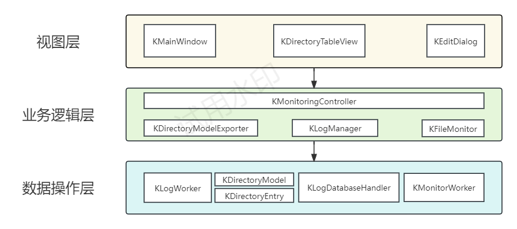

### UML类图

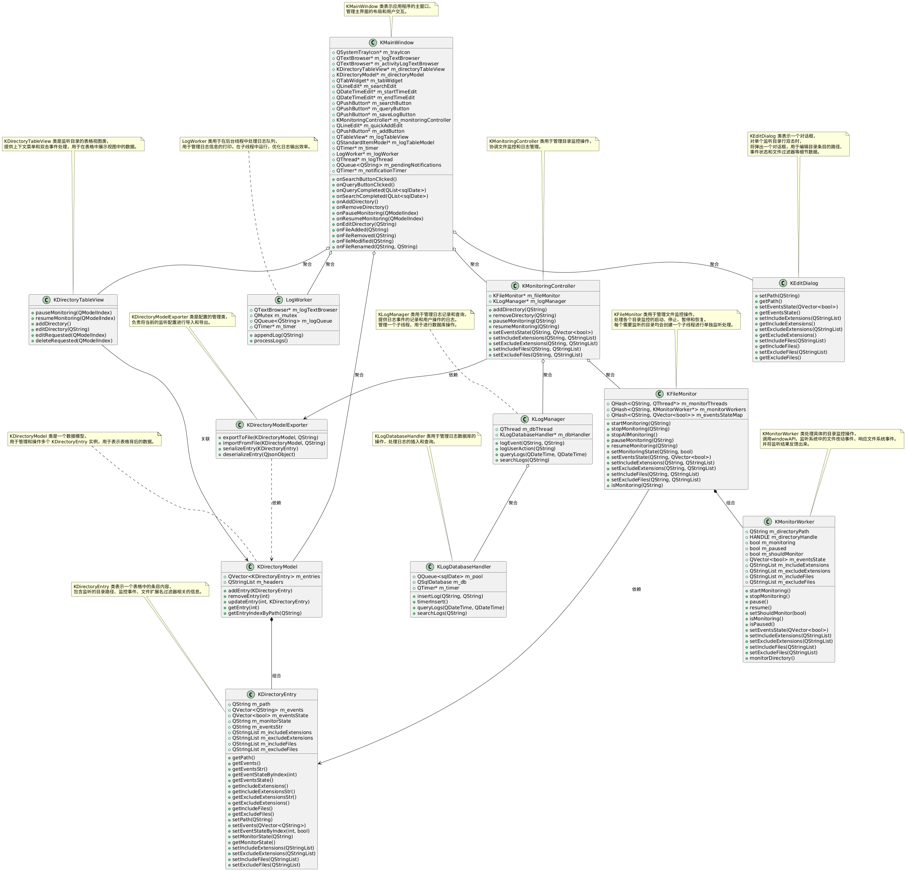


### 1. 类设计与职责划分

项目使用了面向对象的设计思想，每个类在项目中都有明确的职责划分。

#### 1.1 视图层：

- `KMainWindow`：负责程序主界面的UI组件创建及布局，实现UI交互逻辑
- `KDirectoryTableView`： 负责显示当前监听的目录信息，包括监听的设置详细信息。实现表格组件的UI交互逻辑。
- `KEditDialog`： 负责某个监听目录的详细对话框数据展示，提供监听详细设置的展示和保存。

#### 1.2 业务逻辑层：

- `KMonitoringController`：负责管理各个目录的事件监听，配置文件导入导出管理、监听日志数据管理。
- `KDirectoryModelExporter`：负责配置文件导入、导出实现，包括序列化和反序列化实现逻辑。
- `KLogManager`：负责日志的管理，包括数据库的工作子线程的管理。
- `KFileMonitor`：负责各个目录的文件监听管理，包括每个目录的工作子线程的管理。

#### 1.3 数据操作层：

- `KLogWorker`：子线程工作类，负责监听日志输出时的优化，包括日志压缩，和日志输出优化。对日志打印部分进行性能优化。
- `KDirectoryModel`:  负责监听目录的表格数据展示。将模型数据的最新数据及时更新到界面表格中。
- `KMonitorWorker`：子线程工作类，负责单个目录的事件监听。实现个性化的事件监听过滤、暂停监听、恢复监听、停止监听。
- `KLogDatabaseHandler`：子线程工作类，负责监听日志的数据库管理操作，包括时钟轮转数据库批处理插入、数据库信息查询、待插入数据缓存等。

### 2. 类之间的关系与模块化设计

项目中的各个类之间通过聚合、组合、依赖等关系进行连接。例如，`KMainWindow` 类通过聚合的方式与 `KMonitoringController` 和 `KDirectoryModel` 进行交互，`KFileMonitor` 类则通过组合的方式包含 `KMonitorWorker` 实现多线程监控。这种模块化设计确保了项目的扩展性和可维护性，便于后续功能的增加和代码的重构。

### 3. 界面与逻辑的分离

项目在设计时，严格遵循界面与逻辑分离的原则。界面相关的代码集中在 `KMainWindow` 和 `KDirectoryTableView` 等类中，而监控逻辑则封装在 `KFileMonitor` 和 `KMonitoringController` 类中。通过这种设计，项目的各个部分能够独立开发和测试，降低了代码的耦合度，提高了系统的稳定性和可扩展性。

## 五、遇到的问题以及解决

### 1. 监听到大量文件修改事件时，程序无法进行正常执行

分析原因：

1. 大量监听日志从监听层传出，主界面无法在一秒内进行高频次的文字打印，导致程序卡死。
2. 大量日志数据向数据库中添加，导致数据库IO操作开销巨大，程序无法正常执行。
3. 单线程中对数据库进行同步的插入操作，阻塞其他任务的执行

解决方法：

1. 创建子线程处理日志输出，并对连续相同的日志消息压缩合并，减少日志打印次数
2. 主界面日志框一秒内最多打印日志条数20条，其余日志消息省略输出，减少日志信息输出，提高用户体验。
3. 优化数据库插入操作，创建缓存队列保存待插入数据信息，每一个时间周期分批处理缓存中的数据，减少数据库高频操作，造成系统卡顿。

